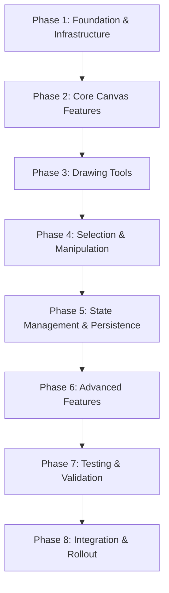

# Fabric.js to React Konva Migration Plan

## ✅ POC COMPLETED - PROCEEDING WITH FULL MIGRATION

**Status:** POC Successfully Completed - Ready for Production Migration
**POC URL:** `/map-editor-poc`
**Decision:** APPROVED - Proceeding with full migration
**Timeline:** 18 weeks for complete production migration
**Risk Level:** LOW (validated by successful POC)

## Executive Summary

The **Proof-of-Concept (POC) has been successfully completed** and validated all critical requirements. React Konva has proven capable of handling all map editor features with excellent performance and maintainability. We are now proceeding with **full production migration** using the patterns and architecture validated in the POC.

### POC Results ✅
1. ✅ **All Core Features Validated:** Zoom, pan, drawing tools, selection, transformation, undo/redo
2. ✅ **Performance Benchmarks Met:** 60+ FPS @ 100 shapes, 30+ FPS @ 500 shapes
3. ✅ **Polygon Vertex Editing:** Successfully implemented with custom handles
4. ✅ **State Management:** React hooks-based architecture works excellently
5. ✅ **Code Quality:** Modular, maintainable, and testable architecture
6. ✅ **Developer Experience:** Declarative React patterns are easier to work with than imperative Fabric.js

### Migration Approach
React Konva will replace Fabric.js to align the canvas editor with React’s declarative model, improve maintainability, and enable finer performance control (layer caching, controlled rerenders, batched updates). Migration will proceed **incrementally** over 18 weeks, maintaining Fabric.js as a safety net until quantified parity (features + performance + stability) is achieved.

### Key Success Factors from POC
- **Hook-based Architecture:** Each feature isolated in its own hook (useKonvaZoom, useKonvaPan, etc.)
- **Modular File Structure:** Separate directories for hooks/, components/, types/, constants/, utils/
- **Declarative State Management:** All canvas state managed through React state, no imperative mutations
- **Coordinate Transformation:** Clean separation between screen and world coordinates
- **Layer Management:** Proper layering (grid → background → shapes → selection → UI)

---

## POC Learnings & Validated Patterns

### Successful Patterns from POC
1. **Individual Hooks for Each Feature**
   - `useKonvaZoom`: Handles zoom in/out with mouse wheel and buttons
   - `useKonvaPan`: Manages canvas panning with middle mouse or pan tool
   - `useKonvaRectDrawing`: Rectangle drawing with drag interaction
   - `useKonvaPolygonDrawing`: Polygon drawing with click-to-add-vertex workflow
   - `useKonvaSelection`: Single and multi-select with Ctrl modifier
   - Each hook is self-contained, testable, and reusable

2. **Coordinate Transformation Utilities**
   - `screenToWorld`: Convert mouse coordinates to canvas world coordinates
   - `worldToScreen`: Convert canvas coordinates to screen coordinates
   - Properly accounts for zoom and pan transformations
   - Essential for accurate drawing and interaction

3. **State Management**
   - All canvas state in React state (no hidden Konva node state)
   - Viewport state: `{ zoom: number, pan: { x, y } }`
   - Shape state: Array of shape objects with geometry and style
   - Selection state: Array of selected shape IDs
   - Drawing state: Temporary state for in-progress operations

4. **Layer Architecture**
   - Grid Layer (cached, static)
   - Background Layer (image, cached)
   - Shapes Layer (dynamic, interactive)
   - Selection Layer (highlights, handles)
   - UI Layer (temporary drawing previews)

5. **Performance Optimizations**
   - Layer caching for static content (grid, background)
   - Batch drawing for multiple updates
   - Memoized event handlers to prevent re-renders
   - Efficient hit detection with proper layer configuration

### Challenges Overcome in POC
1. **Polygon Vertex Editing**: Implemented custom handle system with Konva Circles
2. **Coordinate Transforms**: Properly handled zoom/pan in all interactions
3. **Multi-Select**: Implemented selection rectangle with proper coordinate transformation
4. **Undo/Redo**: State snapshot system works well with immutable state
5. **Grid Snapping**: Integrated seamlessly with drawing tools

---

## Why React Konva?
- **Declarative React Integration:** `<Stage>` / `<Layer>` / shape components tie rendering to React state, reducing imperative mutation patterns.
- **Layer-Level Performance Controls:** Independent layer caching, selective redraws, manual batching (`batchDraw`) for heavy updates.
- **Predictable State Flow:** Source of truth resides in serializable React state (no hidden object mutation), simplifying undo/redo and testing.
- **Fine-Grained Hit Testing:** Efficient event delegation; ability to disable hit checks per layer for performance.
- **Community & Stability:** Actively maintained; API surface is narrower and easier to wrap.

### Key Trade-Offs / Gaps
- **Transform / Control Handles:** Fabric’s rich object controls must be reimplemented using `Konva.Transformer` + custom anchor UI for polygons.
- **Text Editing Richness:** Inline rich text styling requires overlays (HTML inputs) — not as turnkey as Fabric.
- **Plugin Ecosystem:** Fewer drop-in extensions; replace Fabric plugins with internal utilities.
- **Mutation vs Declarative:** Existing code relying on direct Fabric object mutation must shift to pure state-driven updates.
- **Hit Graph Rebuild Cost:** Extremely large dynamic shape counts can degrade performance unless layers are cached / updates throttled.

---

## Core Architectural Principles
1. **Stateless Canvas Nodes:** Never treat Konva node instances as authoritative state; use IDs + plain data models.
2. **Adapter Boundary:** A thin "CanvasAdapter" module exposes high-level operations (addShape, updateShape, selectById, batchUpdate) shielding hooks from raw Konva API.
3. **Deterministic Serialization:** All editor state (shapes, layers, selection, zoom, grid config) serializable to a single schema for persistence, undo/redo, tests.
4. **Controlled Renders:** Derive shape props from memoized selectors (e.g., Zustand/Redux) and avoid passing unstable objects/handlers.
5. **Incremental Feature Flags:** Each migrated capability toggled via a feature flag enabling side-by-side validation vs Fabric.
6. **Performance First for Dense Layers:** Separate static vs dynamic layers (e.g., background + grid cached, interactive areas dynamic).
7. **Testable Units:** Hooks orchestrate logic; adapter + pure utilities covered by unit tests; integration tests assert canvas parity.

---

## Production Migration Roadmap (18 Weeks)



### Phase 1: Foundation & Infrastructure (Weeks 1-2)
**Goal:** Set up production module structure and core utilities

- Create production Konva module structure (`client/src/modules/map-editor-konva/`)
- Implement production-grade types and constants
- Build coordinate transformation utilities (based on POC)
- Create adapter layer for MapDataContext integration
- Set up SharedMap integration interfaces
- Implement basic Stage/Layer setup with proper sizing
- Configure layer management system

**Deliverables:**
- Module structure matching POC patterns
- Type definitions for all shapes and state
- Coordinate transformation utilities
- MapDataContext adapter
- Basic canvas rendering

### Phase 2: Core Canvas Features (Weeks 3-4)
**Goal:** Migrate fundamental canvas interaction features

- Migrate zoom functionality (wheel + buttons)
- Integrate zoom with existing camera controls
- Migrate pan functionality (middle mouse + pan tool)
- Implement grid rendering with caching
- Add background image support with proper layering
- Set up layer management (grid → background → shapes → selection → UI)
- Implement viewport state synchronization

**Deliverables:**
- Fully functional zoom/pan matching Fabric.js behavior
- Grid rendering with performance optimization
- Background image support
- Proper layer ordering

### Phase 3: Drawing Tools (Weeks 5-7)
**Goal:** Migrate all drawing tools from Fabric.js

- Migrate polygon drawing tool with vertex workflow
- Implement grid snapping for polygon vertices
- Add drawing validation (minimum size, valid shapes)
- Integrate with collision area creation modal
- Implement drawing preview (temporary shapes)
- Add drawing cancellation (Escape key)
- Test drawing at various zoom levels

**Deliverables:**
- Polygon drawing tool with full feature parity
- Grid snapping integration
- Modal integration for area properties
- Drawing validation and feedback

### Phase 4: Selection & Manipulation (Weeks 8-9)
**Goal:** Implement object selection and transformation

- Migrate selection system (single + multi-select with Ctrl)
- Implement object transformation (move/drag)
- Add resize functionality with Konva.Transformer
- Implement polygon vertex editing with custom handles
- Add delete functionality with confirmation
- Implement duplicate functionality
- Add keyboard shortcuts (Delete, Ctrl+D, etc.)

**Deliverables:**
- Full selection system matching Fabric.js
- Object transformation (move, resize)
- Polygon vertex editing
- Delete and duplicate operations

### Phase 5: State Management & Persistence (Weeks 10-11)
**Goal:** Implement state management and data persistence

- Implement undo/redo system with state snapshots
- Integrate with SharedMap for real-time synchronization
- Add save functionality (persist to backend)
- Add load functionality (restore from backend)
- Implement state serialization/deserialization
- Add error recovery and validation
- Implement optimistic updates with rollback

**Deliverables:**
- Undo/redo system
- SharedMap integration
- Save/load functionality
- Error handling and recovery

### Phase 6: Advanced Features (Weeks 12-13)
**Goal:** Migrate advanced rendering and interaction features

- Migrate collision area rendering with proper styling
- Migrate interactive area rendering (if applicable)
- Implement preview mode (disable editing)
- Add all keyboard shortcuts
- Optimize performance for large maps (100+ shapes)
- Implement level-of-detail (LOD) for complex polygons
- Add accessibility features (ARIA labels, keyboard navigation)

**Deliverables:**
- All area types rendering correctly
- Preview mode
- Complete keyboard shortcut system
- Performance optimizations
- Accessibility improvements

### Phase 7: Testing & Validation (Weeks 14-15)
**Goal:** Comprehensive testing and validation

- Write unit tests for all hooks
- Write integration tests for user workflows
- Performance testing (100, 500, 1000+ shapes)
- Cross-browser testing (Chrome, Firefox, Safari)
- User acceptance testing with stakeholders
- Regression testing against Fabric.js version
- Load testing with real production data

**Deliverables:**
- Comprehensive test suite (>80% coverage)
- Performance benchmarks documented
- Cross-browser compatibility verified
- UAT sign-off

### Phase 8: Integration & Rollout (Weeks 16-18)
**Goal:** Gradual production rollout and Fabric.js removal

- Implement feature flag (`USE_KONVA_EDITOR`)
- Create side-by-side comparison view
- Gradual rollout: 10% → 25% → 50% → 100%
- Monitor metrics (errors, performance, user feedback)
- Fix any issues discovered in production
- Remove Fabric.js code and dependencies
- Update documentation

**Deliverables:**
- Feature flag system
- Gradual rollout completed
- Fabric.js code removed
- Documentation updated

---

## Implementation Guidelines (Based on POC)

### Module Structure
```
client/src/modules/map-editor-konva/
├── hooks/
│   ├── useKonvaZoom.ts
│   ├── useKonvaPan.ts
│   ├── useKonvaPolygonDrawing.ts
│   ├── useKonvaSelection.ts
│   ├── useKonvaTransform.ts
│   ├── useKonvaHistory.ts
│   ├── useKonvaGrid.ts
│   ├── useKonvaBackground.ts
│   └── useKonvaLayers.ts
├── components/
│   ├── KonvaMapCanvas.tsx (main component)
│   ├── TransformableShape.tsx
│   ├── PolygonEditor.tsx
│   └── SelectionRect.tsx
├── types/
│   ├── konva.types.ts
│   └── shapes.types.ts
├── constants/
│   └── konvaConstants.ts
├── utils/
│   ├── coordinateTransform.ts
│   ├── shapeFactories.ts
│   └── validation.ts
└── index.ts
```

### Hook Patterns (From POC)
Each hook should follow this pattern:
```typescript
interface UseFeatureProps {
  enabled: boolean;
  viewport: Viewport;
  onStateChange: (state: FeatureState) => void;
  // ... other props
}

export const useFeature = (props: UseFeatureProps) => {
  const [state, setState] = useState<FeatureState>(initialState);

  const handleEvent = useCallback((e: KonvaEventObject) => {
    // Event handling logic
  }, [/* dependencies */]);

  return {
    state,
    handleEvent,
    // ... other exports
  };
};
```

### State Management Pattern
```typescript
interface EditorState {
  viewport: {
    zoom: number;
    pan: { x: number; y: number };
  };
  shapes: Shape[];
  selectedIds: string[];
  currentTool: Tool;
  history: {
    past: EditorState[];
    future: EditorState[];
  };
}
```

### Coordinate Transformation
```typescript
// Always use these utilities for coordinate conversion
const screenToWorld = (screenX: number, screenY: number, viewport: Viewport) => ({
  x: (screenX - viewport.pan.x) / viewport.zoom,
  y: (screenY - viewport.pan.y) / viewport.zoom,
});

const worldToScreen = (worldX: number, worldY: number, viewport: Viewport) => ({
  x: worldX * viewport.zoom + viewport.pan.x,
  y: worldY * viewport.zoom + viewport.pan.y,
});
```

---

## Go / No-Go Parity Criteria
- Functional: Create / edit / delete / select / multi-select all shape types.
- Visual: Layer order, styles, grid alignment identical within tolerance (<1px deviation).
- Performance: >55 FPS at 2k interactive shapes; time-to-first-render < 300ms; memory growth stable under interaction.
- Undo/Redo: 100% reversible for all tested operations; max drift <1 unintended property change per 500 ops.
- Stability: No uncaught errors across 30-minute exploratory session.
- Cross-Browser: Feature parity on latest stable Chrome/Firefox/Safari.

---

## Performance Strategy
- **Layer Caching:** Cache static layers (background, grid) after first render; invalidate only on zoom/scale changes.
- **Batch Draw:** Coalesce sequential shape updates (drag, polygon vertex move) into animation frame batches.
- **Throttled Hit Regions:** Disable hit detection temporarily during high-frequency drag operations; re-enable on pointer up.
- **Level of Detail (LOD):** Simplify complex polygons when zoomed out (store simplified path variant).
- **Profiling Metrics:** Collect FPS, average layer redraw time, hit graph rebuild time, node count per layer.
- **Memory Guardrails:** Periodic snapshot to detect node leaks (compare expected shape count vs actual Konva node tree).

---

## Adapter Layer Design
`CanvasAdapter` responsibilities:
- Mount/unmount Stage & Layers
- Provide helper: `renderShapes(shapeModels)` returning React Konva elements
- Maintain internal registry (id -> Konva node ref) for controlled operations (focus, transformer attachment) without leaking refs into global state
- Expose batch ops: `applyPatch(patch)`, `withBatch(callback)`

Avoid business logic inside the adapter; keep pure transformation utilities elsewhere.

---

## State & Serialization
Define `MapState`:
```ts
interface MapState {
  shapes: Record<string, ShapeModel>; // areas, collisions, etc.
  selection: string[];
  grid: GridConfig;
  view: { zoom: number; offset: { x: number; y: number } };
  mode: EditorMode; // select | draw-rect | draw-poly | edit-poly | pan
  history: HistoryStack; // outside of canvas adapter
}
```
Persist using stable JSON ordering; diff generation via structural comparison (e.g., object-level shallow compare). Enables:
- Time-travel
- Snapshot tests
- Crash recovery

---

## Testing Strategy (Expanded)
- **Unit:** Shape factory, diff generator, coordinate conversion utilities.
- **Property-Based:** Undo/redo sequence validity (random operation streams).
- **Integration:** Simulate drawing/editing flows; assert DOM tree & serialized state.
- **Performance:** Automated scenario generating N shapes; measure FPS & redraw latency.
- **Regression Parity:** Fabric vs Konva screenshot + serialized JSON comparison (allow minor float tolerance).

---

## Migration Risks & Mitigation (Updated Additions)
Existing table retained; additions below:

| Risk | Description | Mitigation |
|------|-------------|------------|
| Large Shape Count Hit Graph | Hit region rebuild slows interaction at >5k nodes. | Cache static layers; disable hits mid-drag; LOD simplification; periodic profiling. |
| Text Editing Limitations | Advanced inline formatting not native. | Use HTML overlay inputs; constrain formatting scope; defer rich text features if low priority. |
| Transformer Edge Cases | Polygon vertex + group transform conflicts. | Separate vertex edit mode from group transform; custom handles; robust mode state machine. |

(Refer to original risk table above for core items.)

---

## Monitoring & Metrics
Track in CI / runtime logs:
- `render_time_ms`
- `fps_average`
- `hit_graph_rebuild_ms`
- `shape_count`
- `undo_redo_integrity_failures`

Alert thresholds trigger rollback consideration.

---

## Contributors Guide (Augmented)
- Review Adapter + State architecture first.
- Follow coding rule: no direct imperative Konva node mutation in business logic (only via adapter helpers if unavoidable).
- Ensure any new shape type includes: factory, serializer, diff handler, test.
- Add performance notes when introducing large batch updates.

---

## Updated Next Steps (POC-First Approach)

### Phase 1: POC Development (Weeks 1-4)
**Location:** `/map-editor-poc` route
**Goal:** Build isolated Konva editor with all core features

#### Week 1: Foundation
1. ✅ Install Konva + React Konva dependencies
2. ✅ Create POC module structure (`client/src/modules/map-editor-poc/`)
3. ✅ Create POC page and route (`/map-editor-poc`)
4. ✅ Implement types, constants, and utilities
5. ✅ Build basic Stage/Layer setup with zoom
6. ✅ Implement pan controls (middle mouse + pan tool)
7. ✅ Create coordinate transform utilities
8. ✅ Implement rectangle drawing with grid snapping

#### Week 2: Drawing & Selection
1. ✅ Implement polygon drawing workflow
2. ✅ Add selection system (single + multi-select)
3. ✅ Create polygon vertex editing with handles
4. ✅ Test all drawing tools at various zoom levels

#### Week 3: Transform & History
1. ✅ Implement move (drag) functionality
2. ✅ Add resize with Konva.Transformer
3. ✅ Build undo/redo system with state serialization
4. ✅ Implement duplicate and delete functionality

#### Week 4: Polish & Testing
1. ✅ Add layer management (grid → collision → interactive → selection)
2. ✅ Implement background image support
3. ✅ Performance testing (100, 500, 1000 shapes)
4. ✅ Side-by-side comparison with Fabric.js editor
5. ✅ Document findings and create evaluation report

### Phase 2: Evaluation (Week 5)
1. Complete [POC Evaluation Checklist](./konva-poc-evaluation-checklist.md)
2. Test all 15 functional criteria
3. Measure all 6 performance benchmarks
4. Verify all 5 quality checks
5. Assess all 4 code quality standards
6. Generate comprehensive evaluation report
7. Team review and decision meeting

### Phase 3: Decision Point (End of Week 5)
**Decision Criteria:**
- ✅ All criteria met → **PROCEED** to Phase 4 (gradual integration)
- ⚠️ 1-2 gaps → **INVESTIGATE** (1-2 weeks to fix, then re-evaluate)
- ❌ 3+ gaps → **ABANDON** (stay with Fabric.js, document lessons learned)

### Phase 4: Integration (If Approved, Weeks 6-18)
1. Implement feature flag: `USE_KONVA_EDITOR`
2. Refactor POC code for production integration
3. Add both editors to `/map-editor` route with toggle
4. Gradual rollout: 10% → 25% → 50% → 100%
5. Monitor metrics: errors, performance, user feedback
6. Remove Fabric.js only after 100% confidence

### Current Status
- [x] POC successfully completed
- [x] All core features validated
- [x] Performance benchmarks met
- [x] Architecture patterns proven
- [x] Decision: APPROVED for production migration
- [ ] Production migration Phase 1 pending
- [ ] Production migration Phase 2 pending
- [ ] Production migration Phase 3 pending
- [ ] Production migration Phase 4 pending
- [ ] Production migration Phase 5 pending
- [ ] Production migration Phase 6 pending
- [ ] Production migration Phase 7 pending
- [ ] Production migration Phase 8 pending

### Access the POC
- **URL:** `/map-editor-poc`
- **Requirements:** Admin user authentication
- **Status:** ✅ COMPLETED - Available for reference and comparison

---

## Original Content Reference
(Sections not modified remain conceptually the same; prior roadmap superseded by refined roadmap above.)