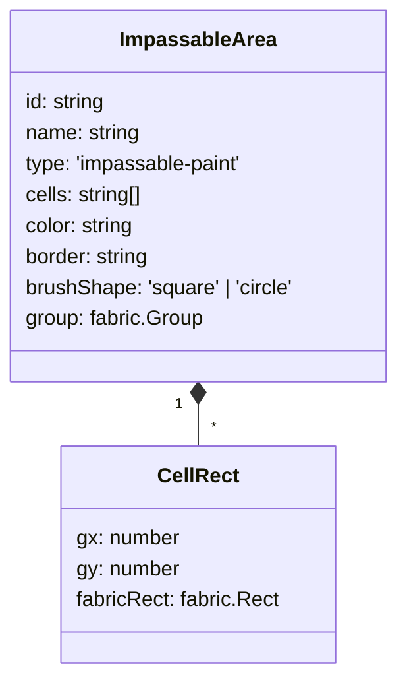
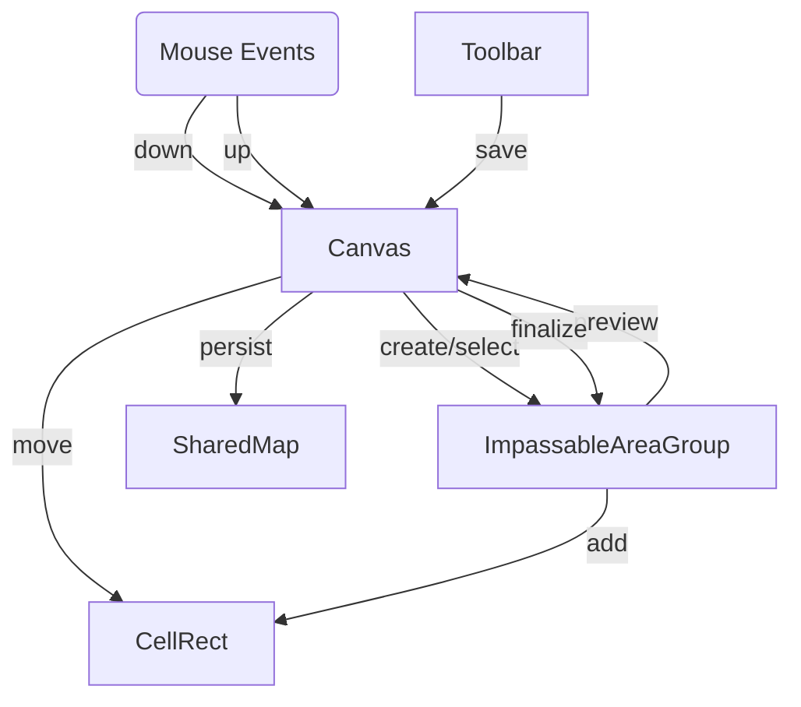

# Impassable Area Painting Feature — Fabric.js-Enhanced Architecture

## Overview

This document proposes a more efficient, robust architecture for painting "impassable areas" (collision paint) on the map editor grid, leveraging Fabric.js groups and object methods to minimize custom logic. The goal is smoother UX, easier extensibility, and maintainable code.

---

## Key Concepts

- **Impassable areas**: Each area is a Fabric.Group of grid-aligned cell rects, with metadata for color, border, brush shape, etc.
- **Cell deduplication**: Managed by group membership (no manual array checks).
- **Preview**: Uses a temporary Fabric.Group for live feedback during paint.
- **Persistence**: Areas/groups are serialized to state/sharedMap only on explicit save.
- **Undo/redo**: Can leverage Fabric.js object history or snapshots.
- **Performance**: Batch operations and caching for fast painting, even on large maps.

---

## Data Model

```typescript
interface ImpassableArea {
  id: string;
  name: string;
  type: 'impassable-paint';
  cells: string[]; // ["3_7", ...] — serialized for persistence
  color?: string;
  border?: string;
  brushShape?: 'square' | 'circle';
  group?: fabric.Group; // runtime reference
}
```

- Each `ImpassableArea` is associated with a Fabric.Group of cell rects.
- Cells exist both as data (for save) and as Fabric.Rect objects in the group.

---

## User Interaction Flow

```mermaid
sequenceDiagram
User->>Canvas: Mouse down (starts painting; area/group created if needed)
Canvas->>ImpassableAreaGroup: Create/select group
User->>Canvas: Mouse move
Canvas->>ImpassableAreaGroup: Add grid cell rect if not present
Canvas->>Canvas: Show live preview (group opacity/style)
User->>Canvas: Mouse up
Canvas->>ImpassableAreaGroup: Finalize group, update area data
Toolbar->>Canvas: Trigger save
Canvas->>SharedMap: Persist area cell data
```

---

## Architecture Diagram



---

## Implementation Steps

1. **Refactor ImpassableArea to include a Fabric.Group**
   - On area creation, instantiate a Fabric.Group; attach metadata.

2. **Cell painting (mouse handlers)**
   - On mouse down/move, snap pointer to grid.
   - If cell rect not present in group, add new Fabric.Rect to group.
   - Deduplication via group membership or cell-key Set.

3. **Preview**
   - While painting, add cell rects to a temporary group (lower opacity, special style).
   - On mouse up, merge preview group into area’s group and update area data.

4. **Batch rendering**
   - Use group.add/remove for efficient cell updates.
   - Leverage Fabric.js caching.

5. **Undo/redo**
   - Store previous group states or use Fabric.js object history.

6. **Persistence**
   - On explicit save, serialize group membership (cell rects) to `cells` array and push to sharedMap.

7. **Brush shape/size**
   - Support extension by swapping in Fabric.js custom brushes or patterns.

8. **Toolbar/Sidebar**
   - Area selection/editing managed by selecting Fabric.Group objects and updating metadata.

---

## UX & Performance Improvements

| Aspect            | Current Logic       | Fabric.js Enhancement           |
|-------------------|--------------------|---------------------------------|
| Deduplication     | Manual array check | Use Fabric.Group membership     |
| Preview           | Manual group add/remove | Toggle group/style, batch update    |
| Area management   | React state array  | Fabric.Group array, sync to state |
| Cell painting     | Manual per cell    | Batch add via group, grid snap   |
| Undo/Redo         | Planned stack      | Use Fabric.js object history    |
| UX performance    | React state churn  | Fabric.js batch, caching         |

---

## Detailed Flow (Fabric.js-centric)



---

## Future Extensibility

- **Brush shapes**: Easily extensible via Fabric.js custom brush logic.
- **Multiple areas**: Managed as Fabric.Group objects; selection/edit in UI.
- **Performance**: Designed for fast batch operations and rendering, even on large maps.
- **Undo/redo**: Optional integration with Fabric.js object history.

---

## Next Steps

1. Implement this architecture in `FabricMapCanvas.tsx` and related modules.
2. Refactor cell painting, deduplication, and preview logic to use Fabric.Group/object APIs.
3. Test for performance on large maps and multiple areas.
4. Integrate with toolbar/sidebar for area/brush selection and save.
5. Optionally add undo/redo using Fabric.js history.

---